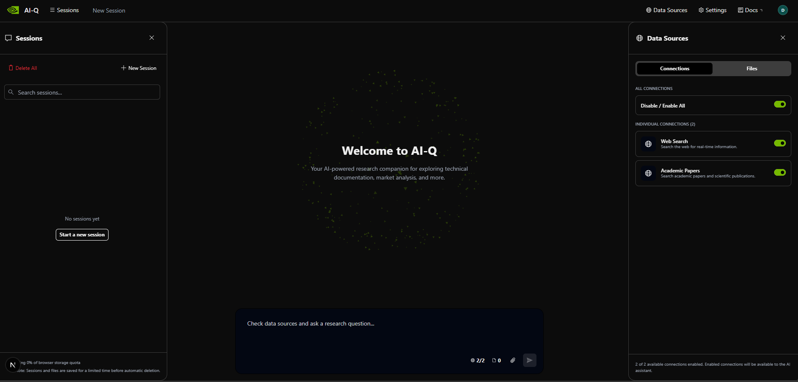

<div align="center">
  

  # AI-Q Blueprint - Agentic Research Assistant

  **Ask once. Get a full report — with citations, sources, and depth.**

  **Powered by NVIDIA NIM · LangGraph · LlamaIndex · FastAPI · React**

  [](https://www.apache.org/licenses/LICENSE-2.0)
  [](https://www.nvidia.com)
  [](https://www.python.org)
  [](https://www.langchain.com/langgraph)

  [🚀 Quick Start](#-quick-start) • [🧠 How It Works](#-how-it-works) • [⚙️ Configuration](#%EF%B8%8F-configuration) • [📖 Customization](#-customization)

</div>

---

## 🤔 Why AI-Q?

**Manual research is slow and fragmented:**

- ❌ Searching the web tab by tab, then summarizing manually
- ❌ Digging through academic papers without synthesis
- ❌ Chatbots with static knowledge, no live search
- ❌ No citations, no source tracking, no structure

**AI-Q solves this:**

- ✅ **Multi-agent workflow** — Intent → Clarify → Research → Synthesize, fully automated
- ✅ **Shallow + Deep research modes** — system auto-selects based on query complexity
- ✅ **3 live data sources** — Web (Tavily), Academic Papers (Serper), Document Knowledge Base (RAG)
- ✅ **Full citations** — every claim traceable to its source
- ✅ **Stream progress in real time** — watch the agent think and research via SSE

---

## 🔄 How It Works

```
┌─────────────────┐
│   User (Chat)   │  (ask anything — research questions, market analysis, technical deep dives...)
└────────┬────────┘
         │ http://localhost:<FRONTEND_PORT>
         ↓
┌────────────────────────────────────────────────┐
│           AI-Q Frontend (React UI)             │
│  • Chat interface                              │
│  • Toggle data sources (Web / Papers / Docs)   │
│  • Stream research progress in real time       │
└────────┬───────────────────────────────────────┘
         │
         ↓
┌────────────────────────────────────────────────┐
│          AI-Q API Backend (FastAPI)            │
│  • Async job management                        │
│  • SSE streaming                               │
│  • Knowledge upload & retrieval API            │
└────────┬───────────────────────────────────────┘
         │
         ↓
┌────────────────────────────────────────────────────────────────┐
│               AI-Q Agent Workflow (LangGraph)                  │
│                                                                │
│  [Intent Classifier] → classify: simple or complex?           │
│          │                                                     │
│          ├──→ [Clarifier] → ask follow-up (max 3 rounds)       │
│          │                                                     │
│          ├──→ [Shallow Researcher] → fast answer + citations   │
│          │       • web_search_tool (Tavily)                    │
│          │       • knowledge_search (RAG)                      │
│          │       • paper_search_tool (Serper)                  │
│          │                                                     │
│          └──→ [Deep Researcher] → multi-loop, multi-source     │
│                  • Planner LLM (gpt-oss-120b)                  │
│                  • advanced_web_search (Tavily)                │
│                  • paper_search (Google Scholar)               │
│                  • knowledge_search (ChromaDB + LlamaIndex)    │
└────────────────────────────────────────────────────────────────┘

Result: Structured report with full source citations, streamed to UI
```

---

## ⚡ Quick Start

**1. Clone and set up environment:**

```bash
git clone <this-repo>
cd aiq
cp deploy/.env.example deploy/.env
```

**2. Fill in required API keys in `deploy/.env`:**

```bash
NVIDIA_API_KEY=nvapi-...      # Required — NIM model access
TAVILY_API_KEY=tvly-...       # Required — web search
SERPER_API_KEY=...            # Required — academic paper search
```

**3. Start the system:**

```bash
./setup.sh --up
```

🎉 Frontend opens at the URL printed in the terminal. AI Hub installs keep host ports inside `6000-6050` by default (`6042` API, `6043` UI, `6044` Next.js internal dev server, `6045` Postgres).

**Stop and clean up:**

```bash
./setup.sh --down     # Stop services
./setup.sh --clean    # Remove local artifacts
```

---

## 🧠 How It Works — Agents & LLMs

### The 4 Agents

| Agent | Role | LLM Used |
|-------|------|----------|
| **Intent Classifier** | Decides: simple question or complex research? | `nemotron-3-nano-30b` |
| **Clarifier** | Asks follow-up questions (max 3 rounds) if query is ambiguous | `nemotron-3-nano-30b` |
| **Shallow Researcher** | Fast answer for factual/simple queries — 1 pass, ≤5 tool calls | `nemotron-3-nano-30b` |
| **Deep Researcher** | Multi-loop research with planning — uses planner + researcher LLMs | `gpt-oss-120b` (planner) + `nemotron-3-nano-30b` (researcher) |

### "Right Model for Right Task"

> AI-Q uses **multiple models simultaneously**, each chosen for its specific strength — not one model for everything.

| Role | Model | Why |
|------|-------|-----|
| Intent / Clarifier | `nvidia/nemotron-3-nano-30b-a3b` | Fast, lightweight classification |
| Shallow research | `nvidia/nemotron-3-nano-30b-a3b` | Speed + thinking capability |
| Deep orchestration | `openai/gpt-oss-120b` | Complex planning, broad reasoning |
| Document summarizer | `nvidia/nemotron-mini-4b-instruct` | Efficient, specialized for summaries |

All models run on **NVIDIA NIM API** (`integrate.api.nvidia.com`).

---

## 📊 Shallow vs Deep Research

| | Shallow | Deep |
|---|---------|------|
| **Best for** | Factual questions, quick lookups | Complex topics, multi-angle analysis |
| **Speed** | Seconds | Minutes |
| **Tool calls** | ≤ 5 | Multi-loop, unlimited |
| **Search type** | Standard web search | Advanced web + papers + RAG |
| **Planning** | None | Dedicated planner LLM |
| **Selected by** | Intent Classifier — **automatic** | Intent Classifier — **automatic** |

You never choose which mode — the system decides based on your query.

---

## 🗂️ Data Sources

| Source | Provider | What it searches |
|--------|----------|-----------------|
| 🌐 **Web Search** | Tavily API | Live web, real-time information |
| 📄 **Academic Papers** | Serper / Google Scholar | Scientific papers and publications |
| 🗃️ **Knowledge Base** | ChromaDB + LlamaIndex (RAG) | Documents you upload via the UI |

Users can toggle each source **per-session** from the frontend. Sources are registered in the config — no code changes needed to add new ones.

---

## ⚙️ Configuration

All runtime behavior is controlled by a **single YAML file**:

```
configs/config_web_default_llamaindex.yml
```

### Add a new data source (no code required):

```yaml
functions:
  data_sources:
    sources:
      - id: my_new_source          # unique key
        name: "My Custom Source"   # shown in UI
        description: "..."         # shown in UI
        tools:
          - my_custom_tool         # NAT function name
```

### Swap a model:

```yaml
llms:
  nemotron_nano_llm:
    _type: nim
    model_name: nvidia/nemotron-3-nano-30b-a3b   # ← change this
    base_url: "https://integrate.api.nvidia.com/v1"
    api_key: ${NVIDIA_API_KEY}
```

### Environment variables supported by `setup.sh`:

| Variable | Default | Description |
|----------|---------|-------------|
| `AIQ_PORT_MIN` | `6000` | Lowest host port `setup.sh` may use |
| `AIQ_PORT_MAX` | `6050` | Highest host port `setup.sh` may use |
| `AIQ_BACKEND_PORT` | `6042` | Backend API port |
| `AIQ_FRONTEND_PORT` | `6043` | Frontend UI port |
| `AIQ_NEXT_INTERNAL_PORT` | `6044` | Internal Next.js dev server port |
| `AIQ_POSTGRES_PORT` | `6045` | PostgreSQL host port |
| `AIQ_CONFIG_FILE` | `configs/config_web_default_llamaindex.yml` | Active config file |
| `AIQ_SUPPORT_SERVICES` | `true` | Enable/disable postgres |
| `AIQ_REQUIRE_FULL_SOURCES` | `false` | Require all API keys |
| `AIQ_ALLOW_UNSOURCED_SIMPLE_ANSWERS` | `true` | Allow direct NVIDIA-only answers when the model explicitly marks that no citation is required |

If a requested port is busy or outside `AIQ_PORT_MIN-AIQ_PORT_MAX`, `setup.sh` picks the next free port in that range and writes the final values to `.runtime/ports.env`.

---

## 📖 Customization

### Customize data sources
Edit tool implementations in:
- `sources/tavily_web_search/` — web search behavior
- `sources/google_scholar_paper_search/` — paper search
- `sources/knowledge_layer/` — RAG / document retrieval (see `KNOWLEDGE-LAYER-SETUP.md`)

### Customize agent behavior
Edit agent configs in `configs/config_web_default_llamaindex.yml`:

```yaml
deep_research_agent:
  max_loops: 2          # increase for deeper research
  verbose: true

shallow_research_agent:
  max_tool_iterations: 5   # adjust tool call budget
```

### Customize the UI
Edit frontend in `frontends/ui/`.

### Customize the API
Edit backend in `frontends/aiq_api/`.

---

## 🔍 Viewing Logs

```bash
tail -f .runtime/backend.log    # Agent & API logs
tail -f .runtime/frontend.log   # UI server logs
cat  .runtime/ports.env         # Actual ports being used
```

Health check:

```bash
curl http://localhost:<BACKEND_PORT>/health
```

---

## 🏗️ Project Structure

```
aiq-blueprint/
├── setup.sh                          # Lifecycle: --up / --down / --clean
├── configs/
│   └── config_web_default_llamaindex.yml  # Main runtime config (models, tools, workflow)
├── src/
│   └── aiq_agent/                    # Core agent workflow (LangGraph)
│       └── agents/
│           ├── chat_researcher/      # Main workflow entry point
│           ├── clarifier/            # Clarification agent
│           ├── shallow_researcher/   # Fast-path research
│           └── deep_researcher/      # Deep multi-loop research
├── frontends/
│   ├── aiq_api/                      # FastAPI backend (async jobs, SSE, knowledge API)
│   └── ui/                           # React frontend (chat, source toggles, streaming)
├── sources/
│   ├── tavily_web_search/            # Web search tool
│   ├── google_scholar_paper_search/  # Paper search tool
│   └── knowledge_layer/              # RAG document retrieval
└── deploy/
    ├── compose/docker-compose.yaml   # PostgreSQL support service
    └── .env.example                  # Environment variable template
```

---

## 📋 Pre-Push Checklist

1. All items in the push list (top of `aiq-explanation.md`) are present
2. No components outside the current scope were added
3. `./setup.sh --up` runs successfully end-to-end
4. `./setup.sh --down` and `./setup.sh --clean` work cleanly

---

## 📄 License

Apache 2.0 — Copyright (c) 2025–2026, NVIDIA CORPORATION & AFFILIATES.

---

<div align="center">
  <sub>Built with ❤️ on NVIDIA Blueprint · Powered by NIM · LangGraph · LlamaIndex</sub>
</div>
